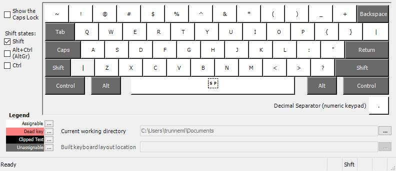
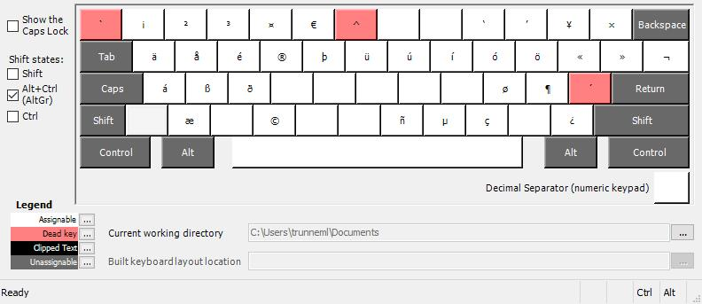
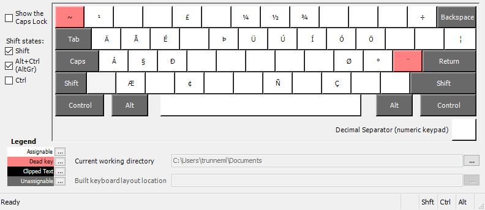

Improved Version Of The US International Keyboard Layout
========================================================

> US International Keyboard Layout without dead keys on stupid positions.

This Windows keyboard layout is based on the Microsoft US International keyboard layout. On the original layout ' and \` are dead keys. So characters often needed while coding, needed multiple key presses. Because of that most software developers are switching between standard US keyboard layout for programming and their native language keyboard layout for writing emails.

US Coding just moved the dead keys of the US International keyboard layout to the AltGr layer. This way it feels like the normal US keyboard layout, but with the full character support of the international version and no keyboard layout switching is needed to write a email in French or German.

This layout (including the `setup.exe`) was created using the [Microsoft Keyboard Layout Creator 1.4](https://www.microsoft.com/en-us/download/details.aspx?id=22339).

**Compatibility**: Windows 7, 8, 8.1 and Windows 10; including 32Bit & 64Bit (amd64 & ia64) versions.

Layers and Differences to the original US International Keyboard Layout
-----------------------------------------------------------------------
- Restored ^, \` and ~.
- Dead Keys ^, \` and ~ moved to the AltGr Layer.
- ¼, ½, ¾ moved to the Shift + AltGr Layer.

### Base Layer

### Shifted Base Layer

### AltGr Layer

### Shifted AltGr Layer

Comparison
----------

| Character | US-Coding          | US-Standard | US-International      |
| :-------: | ------------------ | ----------- | --------------------- |
| `         | `                  | `           | ` , **Space**         |
| ~         | Shift + `          | Shift + `   | Shift + `, **Space**  |
| '         | '                  | '           | ' , **Space**         |
| "         | Shift + '          | Shift + '   | Shift + ' , **Space** |
| ^         | Shift + 6          | Shift + 6   | Shift + 6 , **Space** |
| ¼         | Shift + AltGr + 6  |             | AltGr + 6             |
| Ä         | AltGr + Shift + q  |             | AltGr + Shift + q     |
| ß         | AltGr + s          |             | AltGr + s             |
| €         | AltGr + 5          |             | AltGr + 5             |
| è         | AltGr + `, e       |             | `, e                  |
| ý         | AltGr + ', y       |             | ', y                  |

Installation
------------
Just download the latest release, unzip it and run `setup.exe`.

Manual Build
------------

1. Download and install [Microsoft Keyboard Layout Creator 1.4](https://www.microsoft.com/en-us/download/details.aspx?id=22339)
2. Open the `uscoding.klc` file
3. Project -> Build DLL and Setup Package
4. *(Optional)* Zip the created files